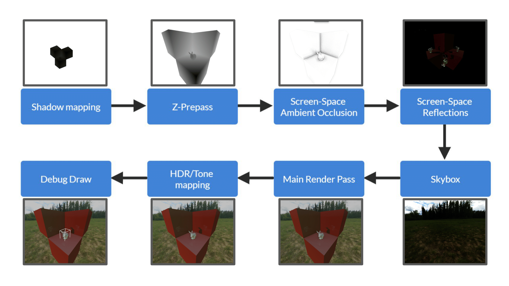

# Catalyst
| Example Scene | Scene in Editor |
| --- | --- |
|   |   |

Catalyst is a physically-based, real-time renderer written in Vulkan and modern C++. This project consists of a library and a user-friendly, interactive editor application written using Qt.

## Graphics Features
|  |
|:--:|
| *How a frame is rendered using Catalyst* |

Catalyst implements many important elements of modern 3D game engines, this list contains some of the major features:

- PBR Material support, based on the Disney Diffuse Model.
- Image Based Lighting with Specular and Diffuse components.
- Global Illumination with Screen-Space Reflections.
- Ambient Occlusion, both with AO texture maps and Screen-Space AO as a fallback.
- Dynamic Directional Lights.
- Environmental Mapping with custom skyboxes.
- Shadow Maps with PCF filtering.
- High Dynamic Resolution (HDR) output with Tonemapping.
- Multisample Anti-Aliasing (MSAA).

## Editor Features
|  |
|:--:|
| *Modifying material properties in the Catalyst editor* |

The included editor provides an interface to test out the library:

- Ability to load custom models and texture images from files on disk.
- Change material parameters, assign texture maps and view the results in real-time.
- Arrange meshes and lights in a scene hierarchy.
- Modify object properties in the scene hierarchy: position, rotation, scale and color.

## License Information

### Third-party libraries
Catalyst makes use of third-party libraries for certain functionality, licensed under the following terms:
#### GLM
[Github](https://github.com/g-truc/glm)\
Included in repository. Modifications to original source include removing documentation. Licensed under the "Happy Bunny" modified MIT license.
#### Assimp
[Github](https://github.com/assimp/assimp)\
Included in repository. Modifications to original source include removing documentation, examples and tests. Licensed under the modified, 3-clause BSD-license.
#### GLFW
[Webpage](https://www.glfw.org/)\
Included in repository. Modifications to original source include removing documentation, examples and tests. Licensed under the zlib/libpng license.
#### Vulkan SDK
[Webpage](https://vulkan.lunarg.com/)\
Must be installed separately. If building using CMake, the path should be deduced automatically.
#### Qt 6
[Webpage](https://www.qt.io/download?hsLang=en)\
Must be installed separately. Required to compile the editor, but Qt is not required to build the library on its own. The default path for Qt 6.2.3 on Windows is included in the `CMakeLists.txt` for the editor. To compile on another platform or with a different version of Qt 6, you must specify the path to Qt using `-DCMAKE_PREFIX_PATH` or by changing the corresponding `CMakeLists.txt` file. The editor links against Qt dynamically.

### Assets
Additionally, a number of default assets (meshes, cubemaps and textures) are included for convenience. Some of these assets come with their own terms and restrictions, listed below.
#### Stanford Bunny
[Webpage](http://graphics.stanford.edu/data/3Dscanrep/)\
This model may only be used for research purposes, not for commercial use.
#### Meadow Cubemap
[Webpage](https://www.humus.name/index.php?page=Cubemap&item=Meadow)\
This cubemap is licensed under the [Creative Commons Attribution 3.0 Unported License](https://creativecommons.org/licenses/by/3.0/)